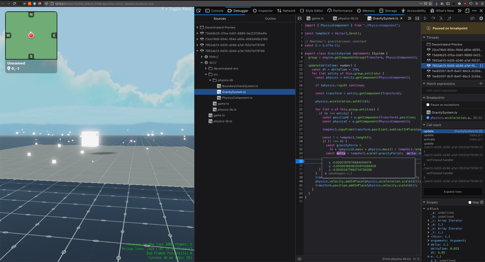
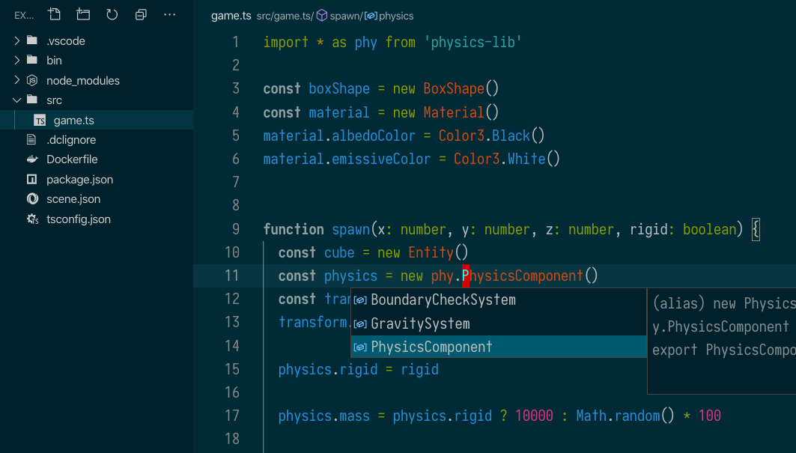

# Example of decentraland scene using a [decentraland library](https://github.com/menduz/dcl-physics-lib)

It uses a [modified version of `build-ecs`](https://github.com/decentraland/explorer/pull/1229) to build and import the assets. It does not work with @next or @latest yet.

For the demonstration, all compiled assets are committed to this repository. ([bin folder](bin))

## How to use a decentraland library?

The easiest way to do it is by NPM, or local linking.

I already [published this library physics-lib](https://npmjs.com/package/physics-lib) to test the whole integration.

1. In a blank scene, run `npm install physics-lib --save-bundle` we use --save-bundle or -B to later tell the compiler to bundle this dependency. This is also a hack, but the intention of our usage is the intended by NPM. We are actually bundling the library.
   ```js
   { // package.json
     "dependencies": {
       "physics-lib": "^1.0.0"
     },
     "bundleDependencies": [
       "physics-lib"
     ]
   }
   ```
2. Run `dcl start` once. It will update the tsconfig.json to include:
    ```json
      "paths": {
        "*": [ "node_modules/physics-lib/dist/physics-lib.d.ts" ]
      },
      "baseUrl": "."
    ```


